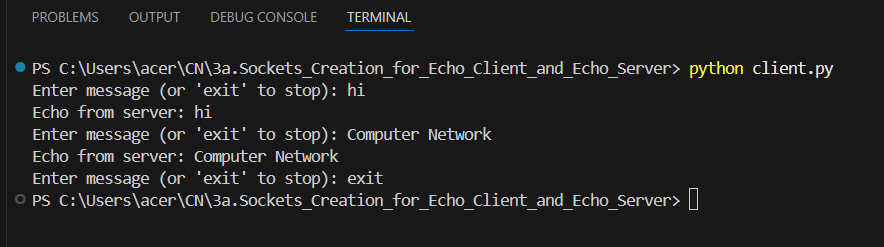
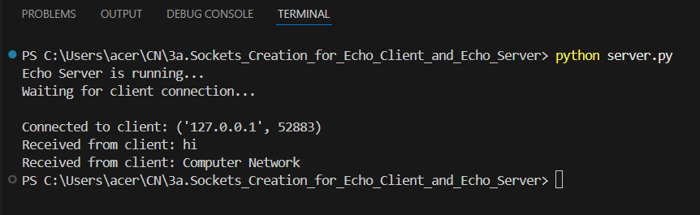

# 3a.CREATION FOR ECHO CLIENT AND ECHO SERVER USING TCP SOCKETS
# AIM
To write a python program for creating Echo Client and Echo Server using TCP
Sockets Links.
## ALGORITHM:
1. Import the necessary modules in python
2. Create a socket connection to using the socket module.
3. Send message to the client and receive the message from the client using the Socket module in
 server .
4. Send and receive the message using the send function in socket.
## PROGRAM
# client 
```
import socket

# Create TCP socket
client = socket.socket(socket.AF_INET, socket.SOCK_STREAM)
client.connect(('localhost', 8000))

while True:
    msg = input("Enter message (or 'exit' to stop): ")

    if msg.lower() == "exit":
        break

    client.send(msg.encode())
    reply = client.recv(1024).decode()
    print("Echo from server:", reply)

client.close()
```
# server
```
import socket

server = socket.socket(socket.AF_INET, socket.SOCK_STREAM)
server.bind(('localhost', 8000))
server.listen(1)

print("Echo Server is running...")
print("Waiting for client connection...\n")

conn, addr = server.accept()
print("Connected to client:", addr)

while True:
    data = conn.recv(1024).decode()
    if not data:
        break

    print("Received from client:", data)
    conn.send(data.encode())  # Echo back

conn.close()
server.close()
```
## OUPUT
# client

# server


## RESULT
Thus, the python program for creating Echo Client and Echo Server using TCP Sockets Links 
was successfully created and executed.
